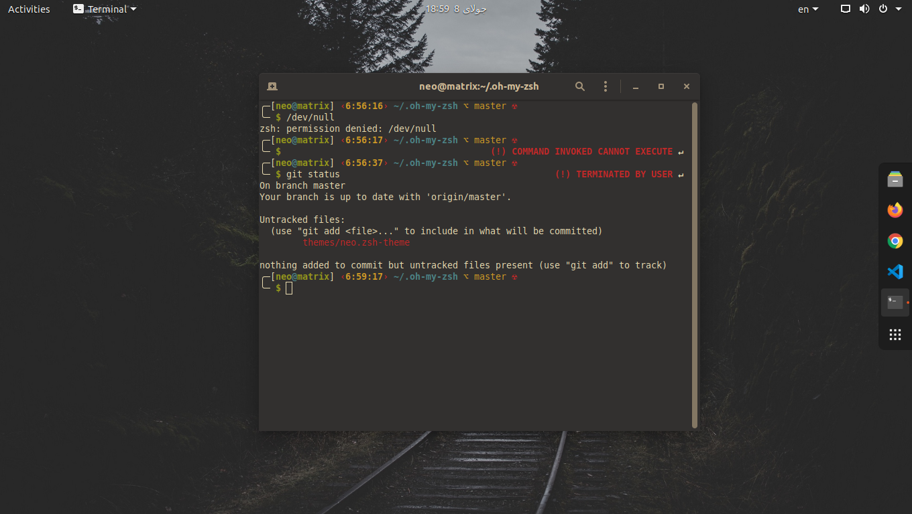

# Neo-ZSH-Theme
A great theme for zsh with time and get support and error message

## Why Neo theme ?
1 - Show some errors as *message*

> 130 => TERMINATED BY USER

2 - Live Clock 🕑

3 - Support git plugin extention
4 - Different colors for root user and SSH mode
## Screenshot

> Font Monospace reqular 10
> Color theme Gruvbox
